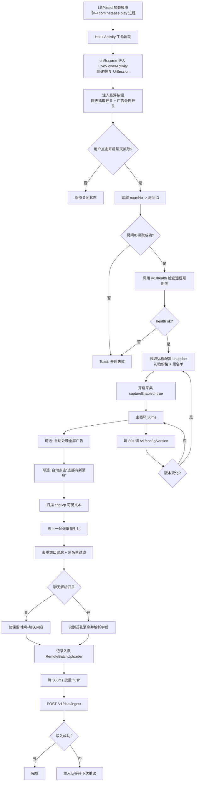

# LSPosedChatUiCollector 模块流程图

## Worker 端接口（供讲解）
- `GET /v1/health`：数据库连通性检查
- `GET /v1/config/version`：配置版本检查
- `GET /v1/config/snapshot`：礼物价格 + 黑名单全量配置
- `POST /v1/chat/ingest`：批量写入聊天记录
- `GET /v1/chat/list`：只读查询聊天记录

